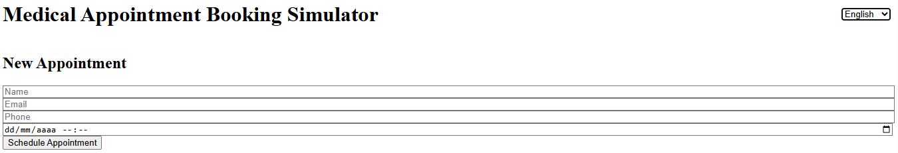
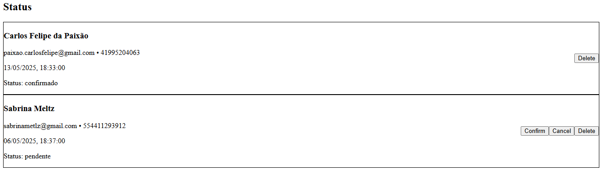

# 🩺 rendezvousqc – Simulateur de prise de rendez-vous médical | Medical Appointment Booking Simulator

**FR (Québec)** | **EN (English)**

---

## 🎯 Objectif | Purpose

**FR**  
Ce projet est un simulateur complet de prise de rendez-vous médical, inspiré des principes de fonctionnement des services de santé publics du Québec (ex. : RAMQ). Il a été conçu pour démontrer la capacité de développer des applications Web modernes, intuitives et alignées avec les besoins numériques du secteur public québécois.

**EN**  
This project is a full-stack medical appointment simulator inspired by the principles of Québec's public healthcare systems (e.g., RAMQ). It was built to showcase the ability to design modern, intuitive, and purpose-driven web applications, aligned with the digital service expectations of Québec’s public sector.

---

## 🛠️ Technologies utilisées | Technologies Used

- **Frontend**: React + Tailwind CSS (Vite)
- **Backend**: Node.js + Express + Joi + dotenv
- **Persistence**: JSON file (simulates a database)
- **UI Style**: Minimalist, accessibility-focused interface

---

## 🚀 Fonctionnalités | Features

**FR**
- Formulaire de réservation avec validation
- Affichage dynamique des rendez-vous existants
- Modification du statut : *en attente*, *confirmé*, *annulé*
- Suppression d’un rendez-vous

**EN**
- Booking form with validation
- Real-time display of scheduled appointments
- Status updates: *pending*, *confirmed*, *cancelled*
- Delete appointment functionality

---

## 📂 Lancement local | Local Setup

### Démarrer l’API (backend) | Start the API (backend)

```bash
cd backend
npm install
npm start
```

### Lancer l’interface (frontend) | Start the interface (frontend)

```bash
cd frontend
npm install
npm run dev
```

Ouvrir dans le navigateur | Open in browser: http://localhost:5173

---

## 📸 Captures d’écran | Screenshots

### Formulaire de prise de rendez-vous  


### Liste de rendez-vous avec gestion de statut  



---

## 🌍 Public cible | Target Audience

**FR**  
Conçu pour les équipes numériques œuvrant dans les services publics, les entreprises technologiques québécoises et les agences qui souhaitent voir des exemples concrets de solutions applicables au contexte local.

**EN**  
Intended for public-sector digital teams, Québec-based tech companies, and agencies seeking real examples of solutions tailored to the provincial context.

---

## 💡 Pourquoi ce projet? | Why this project?

**FR**  
Dans un monde où l’accessibilité et l’efficacité des services publics numériques sont essentielles, ce projet démontre comment des outils simples, bien conçus et localement adaptés peuvent répondre à ces besoins.

**EN**  
In a world where accessibility and efficiency in public digital services are essential, this project shows how simple, well-designed, and locally adapted tools can meet those demands.

---

## 📘 Licence

Ce projet est un démonstrateur éducatif et libre. Aucune licence commerciale associée.  
This is an educational and free-to-use demo project. No commercial license included.
